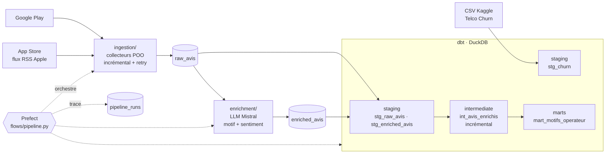
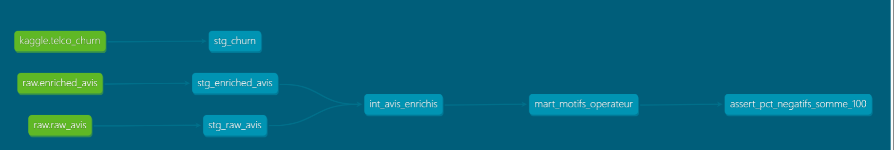
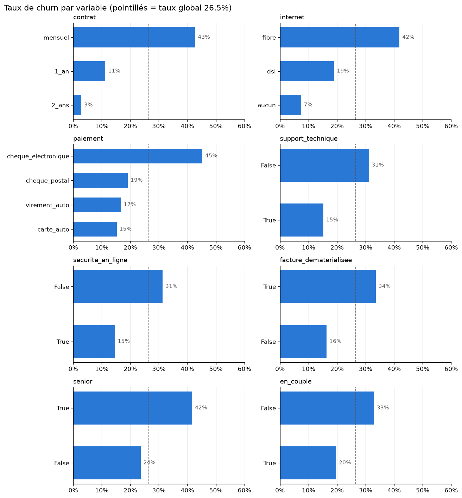

# Telco 360 — pipeline de données sur la voix du client télécom


Pipeline de données **de bout en bout** : collecte de vrais avis clients d'opérateurs télécom français
(Orange, SFR, Bouygues), enrichissement par **LLM** (motif + sentiment), modélisation **dbt**,
orchestration **Prefect**, le tout testé, conteneurisé et vérifié en **CI**.
En parallèle, un dataset de churn (Kaggle) sert à étudier ce qui fait partir les clients.

> **La question métier :** de quoi se plaignent vraiment les clients télécom, et est-ce que ces plaintes
> rejoignent les facteurs qui font partir les clients ?

---

## Architecture



Toutes les tables vivent dans un seul fichier **DuckDB** (`data/telco360.duckdb`).

---

## Stack

| Besoin | Outil | Pourquoi |
|---|---|---|
| Environnement | **uv** (`pyproject.toml` + `uv.lock`) | installation reproductible, versions verrouillées |
| Stockage | **DuckDB** | base analytique en un fichier, SQL rapide, zéro serveur |
| Ingestion | Python (POO), `google-play-scraper`, flux RSS Apple, `tenacity` | sources hétérogènes derrière une interface commune |
| Enrichissement | LLM **Mistral** via client `openai` compatible | changer de fournisseur (Mistral, Azure OpenAI, Groq…) = changer le `.env` |
| Transformation | **dbt** (dbt-duckdb, dbt_utils) | SQL versionné, testé, documenté |
| Orchestration | **Prefect** | pipeline en une commande, retries, planification |
| Qualité | **pytest**, **ruff**, **pre-commit** | tests sans réseau, lint + format automatiques |
| CI | **GitHub Actions** | chaque push : lint, tests, dbt build, build Docker |
| Conteneur | **Docker** + Compose | le pipeline tourne partout de la même façon |

---

## Ce que fait le pipeline

1. **Ingestion** (`ingestion/`) — une classe abstraite `AvisCollector` impose un schéma commun ;
   `GooglePlayCollector` et `AppStoreCollector` en héritent. Chargement **incrémental et idempotent**
   dans `raw_avis` (clé `source + id`, `INSERT OR IGNORE`) : relancer n'ajoute que les nouveaux avis.
2. **Enrichissement LLM** (`enrichment/`) — chaque avis reçoit un **motif** (réseau, facturation,
   résiliation, service client, autre) et un **sentiment**, en JSON contrôlé (valeurs hors liste ramenées
   à `autre` / `neutre`). Incrémental, arrêt propre en cas de limite de requêtes (429).
3. **Transformation dbt** (`transform/`) — trois couches :
   - **staging** : nettoyage, un modèle par source ;
   - **intermediate** : `int_avis_enrichis`, jointure avis + LLM, **modèle incrémental** ;
   - **marts** : `mart_motifs_operateur`, table d'analyse finale.
4. **Orchestration** (`flows/`) — un flow Prefect enchaîne les trois étapes ; chaque étape écrit une ligne
   dans **`pipeline_runs`** (durée, statut, lignes ajoutées, erreur) : on sait toujours ce qui a tourné.



---

## Résultats clés

**Avis clients** — part de chaque motif parmi les avis **négatifs** (échantillon de 2 450 avis, sept. 2026) :

| Opérateur | Réseau | Service client | Facturation | Résiliation | Autre (appli…) |
|---|---|---|---|---|---|
| Bouygues | **31,7 %** | 15,1 % | 17,7 % | 1,6 % | 33,9 % |
| Orange | 20,0 % | **21,9 %** | 15,7 % | 2,6 % | 39,9 % |
| SFR | **27,1 %** | 17,2 % | 18,0 % | 3,9 % | 33,8 % |

- Le **réseau** domine les plaintes chez Bouygues et SFR, le **service client** chez Orange.
- Réseau et facturation ont les **pires notes** (≈ 1,9 à 2,4 / 5).
- La **résiliation** n'apparaît presque jamais (2 à 4 %) : les clients qui partent ne laissent pas d'avis.

**Churn** (dataset Kaggle, 7 043 clients, 26,5 % de churn) — `notebooks/01_eda_churn.ipynb` :

| Facteur | Plus risqué | Moins risqué |
|---|---|---|
| Contrat | mensuel **43 %** | 2 ans **3 %** |
| Ancienneté | 0-6 mois **53 %** | 49-72 mois **10 %** |
| Internet | fibre **42 %** | sans internet **7 %** |
| Paiement | chèque électronique **45 %** | carte auto **15 %** |

**Le lien entre les deux :** les 4 motifs des avis se retrouvent dans les facteurs de churn
(contrat → résiliation, fibre → réseau, paiement → facturation, support technique → service client).
L'intention de partir ne se lit pas dans les avis mais dans le **contrat** : les deux sources sont complémentaires.



---

## Qualité et fiabilité

- **14 tests pytest**, sans réseau ni clé API (sources et LLM simulés).
- **31 tests de données dbt** : unicité, valeurs autorisées, intégrité référentielle, bornes (`dbt_utils`)
  et un **test métier** SQL (les parts de motifs somment à 100 % par opérateur).
- **Fraîcheur des sources** : alerte si l'ingestion n'a pas tourné depuis 2 jours, erreur au-delà de 7.
- **CI GitHub Actions** à chaque push : `uv sync --locked` → ruff → pytest → dbt build sur une base fictive
  → fraîcheur → build de l'image Docker.
- **pre-commit** : ruff à chaque commit + garde-fous (interdiction de commiter `.env`, blocage des gros fichiers).
- **Secrets** hors du code et hors de l'image Docker (`.env`, passé au lancement).

---

## Lancer le projet

### Prérequis
- [uv](https://docs.astral.sh/uv/) (installe aussi Python 3.13)
- une clé API LLM (ex. Mistral, offre gratuite) pour l'enrichissement
- le CSV [Telco Customer Churn](https://www.kaggle.com/datasets/blastchar/telco-customer-churn)
  (`WA_Fn-UseC_-Telco-Customer-Churn.csv`) à placer dans `data/`

### Installation
```bash
git clone https://github.com/raoufRahmani/Telco-360.git
cd Telco-360
uv sync
cp .env.example .env        # puis renseigner LLM_API_KEY
```

### Pipeline complet (ingestion → LLM → dbt)
```bash
uv run python -m flows.pipeline              # une exécution
uv run python -m flows.pipeline --limit 50   # enrichit au plus 50 nouveaux avis
uv run python -m flows.pipeline --serve      # planifié tous les jours à 6h
uv run python -m flows.suivi                 # derniers runs (pipeline_runs)
```

### Étape par étape
```bash
uv run python -m ingestion.run
uv run python -m enrichment.run
cd transform && uv run dbt deps && uv run dbt build --profiles-dir .
uv run dbt source freshness --profiles-dir .
uv run dbt docs generate --profiles-dir . && uv run dbt docs serve --profiles-dir .
```

### Avec Docker
```bash
docker compose build
docker compose run --rm pipeline                       # un run complet
docker compose run --rm pipeline python -m flows.suivi
```
Les données restent sur la machine (`./data` monté dans le conteneur) et la clé API vient du `.env`.

### Tests et qualité
```bash
uv run pytest -q
uv run ruff check . && uv run ruff format --check .
```

---

## Structure

```
ingestion/     collecteurs d'avis (Google Play, App Store) + chargement DuckDB
enrichment/    enrichissement LLM (motif, sentiment)
transform/     projet dbt : staging → intermediate → marts, tests, sources
flows/         orchestration Prefect + suivi des runs (pipeline_runs)
notebooks/     exploration (EDA churn)
scripts/       base fictive pour la CI
tests/         tests pytest (sans réseau)
docs/          énoncé du projet, figures
```

---

## Choix techniques et limites

- **Reddit abandonné** : la création d'app pour l'API officielle est fermée aux projets personnels
  (Responsible Builder Policy) → remplacé par les avis App Store.
- **Free** absent : application introuvable de façon fiable sur les stores.
- **Biais d'échantillonnage** : Google Play ne donne que les avis les plus récents, et le flux Apple varie
  selon le tri (parfois vide pour Orange). Les chiffres décrivent un **instantané**, pas un classement
  des opérateurs.
- **Classification LLM** par un petit modèle gratuit : quelques erreurs sur les avis ambigus ou ironiques.
- **Pas de jointure client** entre avis et dataset Kaggle (clients américains, anonymes) : le lien se fait
  par **motif**, au niveau des tendances.
- **DuckDB** = un seul processus écrivain à la fois : adapté à ce volume, à remplacer par un entrepôt
  (ex. Azure, BigQuery) pour un usage multi-utilisateurs.

---

## Suite du projet

- [ ] Modèle de churn : baseline régression logistique vs **XGBoost**, explicabilité **SHAP**
- [ ] **RAG** sur les avis : questions en langage naturel, réponses sourcées
- [ ] Application **Streamlit**
- [ ] Déploiement **Azure** (stockage Blob pour la couche brute, job planifié)

---

**Auteur :** Abderraouf Rahmani — M2 MoSEF, Université Paris 1 Panthéon-Sorbonne
